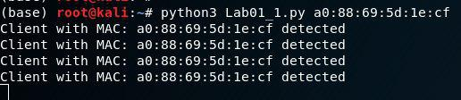
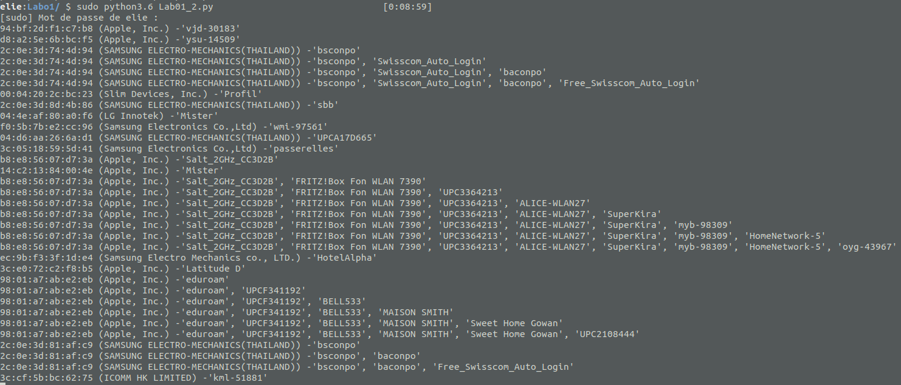

<h1>
 SWI 
</h1>

<h1>
 Laboratoire 1 
</h1>

<h2>
 Nuno Miguel Cerca Abrantes Silva, Elie N'djoli 
</h2>

##### Question : quel type de trames sont nécessaires pour détecter les clients de manière passive ?

Des trames de type Probe request

##### Question : pourquoi le suivi n'est-il plus possible sur iPhone depuis iOS 8 ?

A cause de la MAC Randomisation. Puisque les iPhone n'on plus d'adresse MAC fixe, il n'est plus possible de suivre l'adresse MAC cible

### Partie 1

Capture d'écran de la détection du client ayant l'adresse MAC a0:88:69:5d:1e:cf

### 

### Partie 2

Lors de l'exécution du script `Lab01_2.py`, les clients s'affiche avec les noms de réseau auxquels ils aimerai se connecter. De plus, on peut voir (sur l'image ci-dessous) la marque du constructeur de l'interface wifi en parenthèse après les adresses MAC.

